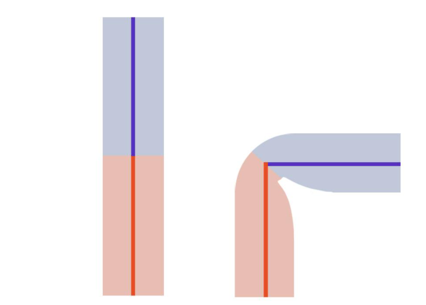
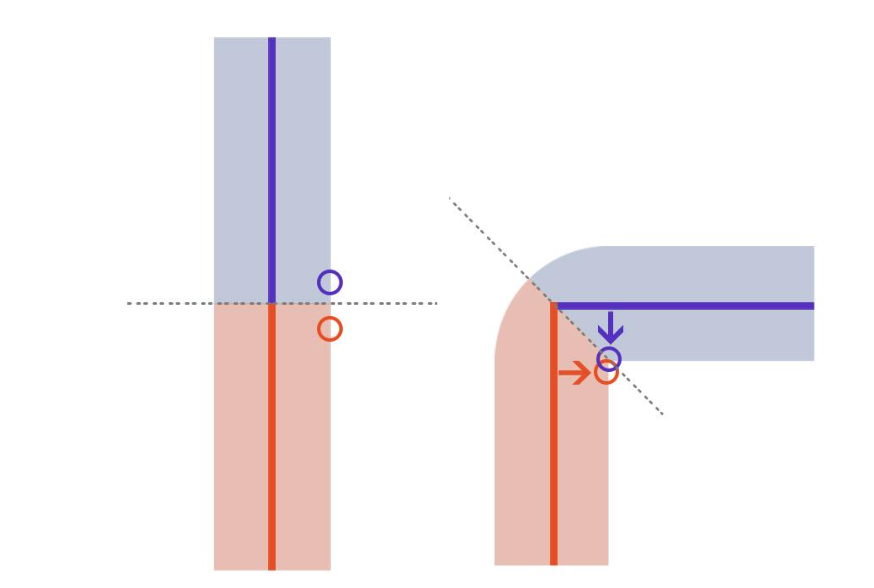
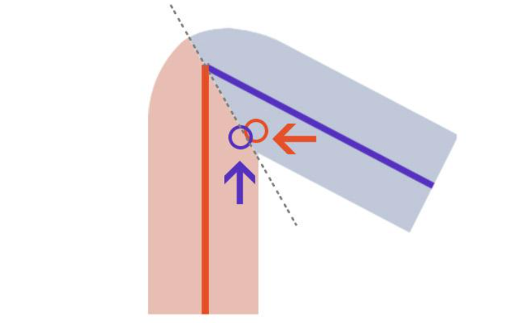
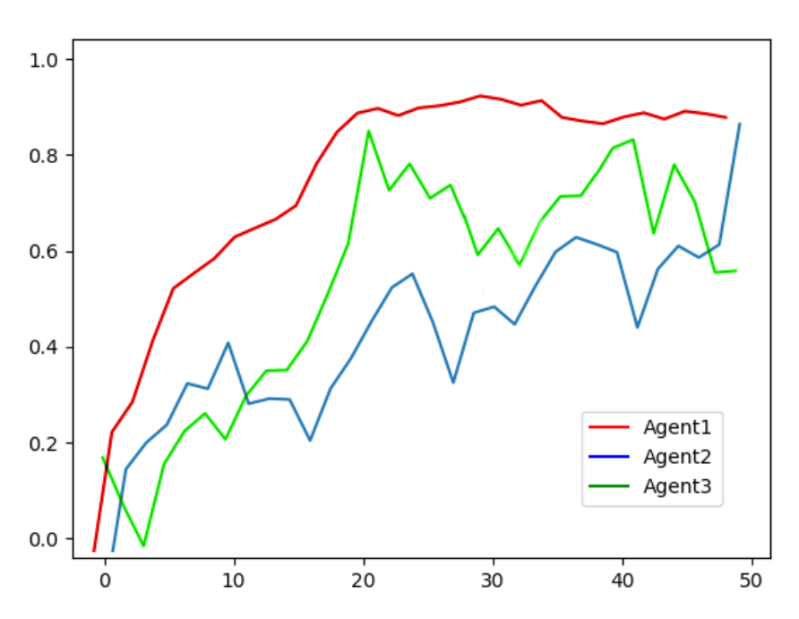
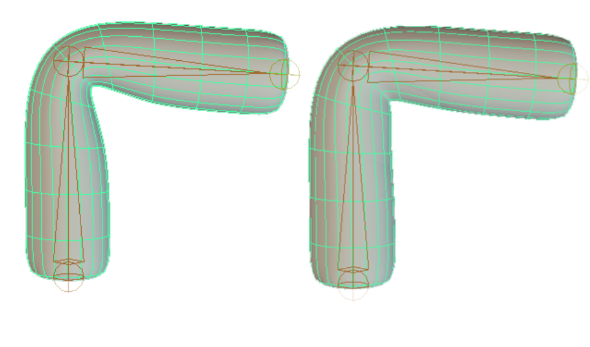
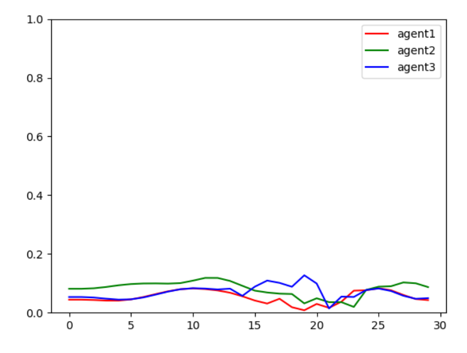

> **Disclaimer:** This code and implementation are intended solely for research and experimental purposes. It has not been tested, optimized, or validated for production environments.

---

# Volume Preservation on Skinned Articulations with Reinforcement Learning

**Mauro Lopez** — *XCS229ii* — *December 2020*

<video src="images/vprl.mp4" width="100%" controls autoplay loop muted></video>

## Abstract

The technique called "skeletal subspace deformation", also known as linear blend skinning (LBS / smooth skinning), is widely used for character deformations due to its ease of use and low computational cost. However, this method suffers from volume loss near bending joints.

A common workaround is for artists to manually add and animate helper joints to counteract volume loss and create visually appealing articulation. This process is time-consuming and must be repeated per character.

We show that well-known reinforcement learning (RL) methods can be adapted to learn robust control policies. Given a set of limb examples, an agent can learn how to manipulate auxiliary joints to automatically compensate for volume loss and resolve simple self-collisions in real-time.

**Keywords:** Volume preservation, linear blend skin, reinforcement learning, character rigging, PPO.

---

## 1. Introduction

In character animation, skinning is the process of defining how the geometric surface of a character deforms as a function of skeletal poses. Producing compelling, believable deformations is a core challenge across animated feature films, video games, and interactive applications.

Traditionally, skin deformation is computed via Linear Blend Skinning (LBS):
* Simple linear blending of bone transformations fails to capture complex deformations.
* Affine subspace restrictions lead to severe volume loss ("candy-wrapper" and collapsing joint artifacts) at articulation points.
* Fixing these artifacts manually requires significant artistic effort.

*Fig. 1: (Left) A simple limb: two segments with an articulation in the middle. (Right) Volume loss generated by standard linear smooth skinning.*

Physics-based simulations capture secondary effects (jiggling, muscle bulges, contact deformations) but are computationally heavy and unsuitable for low-latency, real-time engines.

### Related Work

* **Direct Deformation Methods:** Techniques like *Position-Based Skinning* and *Implicit Skinning* utilize internal geometry/implicit surfaces to calculate volume preservation and contact. While effective for offline rendering, they present high overhead for real-time applications.
* **Learning-Based Methods:** Approaches such as *Skinning from Examples* and *Fast and Deep Deformation Approximations* approximate pre-corrected rigs via supervised neural networks. *Smooth Skinning Decomposition with Rigid Bones (SSDR)* extracts joint clouds directly from deformation sequences but yields representations that are difficult to edit downstream.

### Contribution

We propose a reinforcement learning framework that trains an agent-joint system directly on bending limb animation data. The policy learns optimal corrective transformations that maintain local volume and resolve self-intersections without requiring pre-solved deformation training sets.

---

## 2. Methods

The task is framed as a standard RL problem: an agent interacts with an environment according to a policy $\pi(a|s)$ to maximize expected cumulative reward.

*Fig. 2: (Left) Agents placed on the problematic area. (Right) Agents learn to move away from the closer segment to preserve interior volume.*

### Policy & Value Architecture
* **Algorithm:** Proximal Policy Optimization (PPO) using a clipped surrogate objective and Generalized Advantage Estimation (GAE).
* **Policy Network:** Fully connected multilayer perceptron (MLP) with layer sizes `[1024, 512]`, ReLU activations, and a linear action output layer.
* **Value Network:** Identical MLP architecture with a 1D scalar linear output unit.
* **Discounting:** An aggressive discount factor ($\gamma$) is used to prioritize immediate volume preservation over long horizons.

### State Space ($s$)
* Relative positions of each agent with respect to the limb joints.
* Limb joint rotations represented as quaternions.
* Bind distance vectors relative to the nearest segment (expressed in the local coordinate frame with the agent's z-axis oriented toward the limb).

### Action Space ($a$)
* Continuous z-axis local translation values per agent, driving motion toward or away from the nearest limb segment.

### Reward Function ($r_t$)
The scalar reward balances two primary objectives:
1. Minimizing the delta between the current distance and the initial rest-pose binding distance to the closest bone segment.
2. Imposing negative reward penalties if an agent crosses the symmetry plane / boundary into the opposing limb segment (preventing self-intersection during acute joint bends).

*Fig. 3: Simple self-collision detection. If the blue agent invades the red area, it receives a negative reward, forcing it to retreat toward the blue segment, and vice versa.*

---

## 3. Results

The framework was evaluated on a standard two-segment articulated limb mesh bound with default linear skinning:
* **Setup:** 3 corrective agent joints placed at the joint fold region; training sequence comprised a 32-frame bend cycle ($0^\circ$ to $140^\circ$).
* **Training Data:** 16 rollouts per batch (460 training samples, 52 validation samples) across 50 optimization sessions.

*Fig. 4: Cumulative rewards across 50 training sessions for all three agents.*

### Key Observations
* **Convergence:** All three agents steadily maximized their reward, discovering stable positioning policies that counter volume collapse.
* **Artistic Parity:** In validation tracking against hand-keyed corrective joints created by an artist, the RL policy stayed within a $<0.1$ spatial deviation margin across the motion range.
* **Performance:** Once trained, the forward inference cost is negligible, preserving native real-time LBS performance during runtime playback.

*Fig. 5: (Left) Limb bending without agent influence. (Right) Corrected deformation with agents preserving interior volume.*

*Fig. 6: Spatial distance error per frame relative to artist-authored helper joints.*

---

## 4. Discussion & Future Work

This project serves as a proof of concept for training unsupervised, policy-driven control agents to automate corrective rigging tasks.

### Future Directions
* **Automated Weighting:** Replace manual vertex weight assignment to helper joints with least-squares skin weight optimization.
* **Complex Deformations:** Extend the reward definitions to handle muscle expansion/bulging, dynamic sliding, and multi-agent communication networks for full-body mesh volume conservation.

---

## References

1. **Mohr, A., & Gleicher, M.** (2003). *Building Efficient, Accurate Character Skins from Examples.* ACM Transactions on Graphics (TOG), 22(3), 562–568.
2. **Bailey, S. W., Otte, D., Dilorenzo, P., & O'Brien, J. F.** (2018). *Fast and Deep Deformation Approximations.* ACM Transactions on Graphics (TOG), 37(4), Article 119.
3. **Vaillant, R., Barthe, L., Guennebaud, G., Cani, M. P., Rohmer, D., Wyvill, B., Gourmel, O., & Paulin, M.** (2013). *Implicit Skinning: Real-Time Skin Deformation with Contact Modeling.* ACM Transactions on Graphics (TOG), 32(4), Article 125.
4. **Rumman, N. A., & Fratarcangeli, M.** (2015). *Position-Based Skinning for Soft Articulated Characters.* Computer Graphics Forum, 34(1), 1–11.
5. **Le, B. H., & Deng, Z.** (2012). *Smooth Skinning Decomposition with Rigid Bones.* ACM Transactions on Graphics (TOG), 31(6), Article 199.
6. **Schulman, J., Wolski, F., Dhariwal, P., Radford, A., & Klimov, O.** (2017). *Proximal Policy Optimization Algorithms.* arXiv preprint arXiv:1707.06347.